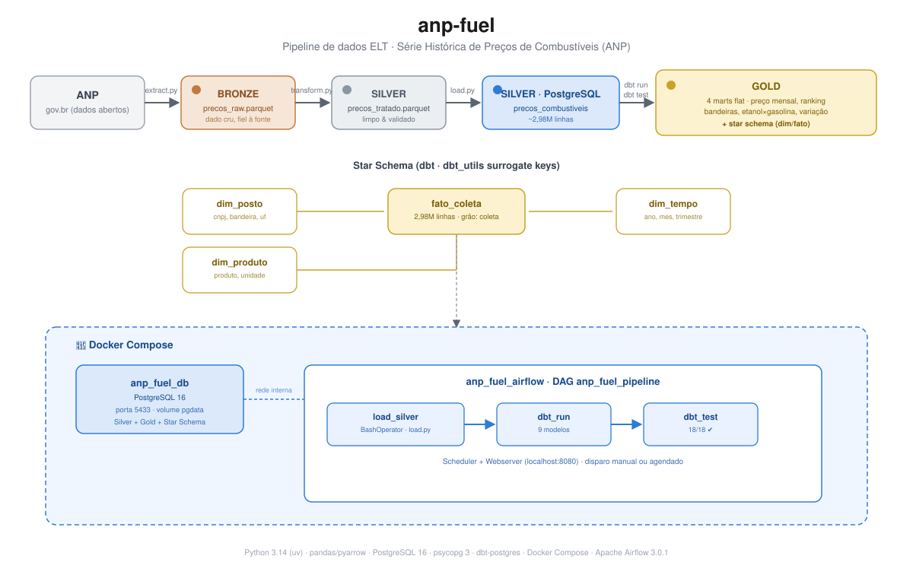

# ⛽ anp-fuel — Pipeline de Preços de Combustíveis (ANP)

Pipeline de dados completo (ELT) que ingere a **Série Histórica de Preços de
Combustíveis** da ANP (Agência Nacional do Petróleo), organiza os dados em
**arquitetura medalhão** (Bronze → Silver → Gold), modela um **star schema**
analítico via **dbt**, aplica **carga incremental** e orquestra toda a
esteira com **Apache Airflow** — tudo containerizado com **Docker Compose**.



## 🏗 Arquitetura

```
ANP (gov.br)
   │
   │  extract.py          (incremental: baixa só os semestres novos)
   ▼
🥉 Bronze — data/bronze/precos_raw.parquet          [dado cru, fiel à fonte]
   │
   │  transform.py        (limpeza, tipos, deduplicação, validações)
   ▼
🥈 Silver — data/silver/precos_tratado.parquet      [dado limpo e validado]
   │
   │  load.py             (upsert: INSERT ... ON CONFLICT DO UPDATE)
   ▼
🥈 Silver no PostgreSQL — precos_combustiveis       [~3,4M linhas]
   │
   │  dbt run + dbt test  (modelagem analítica em SQL)
   ▼
🥇 Gold — 4 marts flat + Star Schema (dim/fato)     [prontos para consumo]

═══════════════════════════════════════════════════════════════════
  🐳 Docker Compose: PostgreSQL + Apache Airflow
  🌀 DAG anp_fuel_pipeline: load_silver → dbt_run → dbt_test
═══════════════════════════════════════════════════════════════════
```

## 🔄 Carga incremental

O pipeline não reprocessa o histórico inteiro a cada execução:

- **`extract.py`** detecta o último `ano_ref`/`semestre_ref` presente no
  Bronze e baixa apenas os períodos publicados depois dele, concatenando
  com o que já existe.
- **`transform.py`** deduplica pela chave de negócio
  (`cnpj + produto + data_coleta`), consolidando por média os casos em que
  a fonte reporta mais de uma amostragem para o mesmo posto/produto/dia.
- **`load.py`** faz **upsert** (`INSERT ... ON CONFLICT DO UPDATE`) em vez
  de `TRUNCATE` + `INSERT`: registros novos são inseridos, registros já
  existentes têm o valor atualizado — sem duplicar e sem apagar a tabela
  a cada rodada. A unicidade é garantida por uma constraint
  (`uq_coleta`) criada de forma idempotente pelo próprio script.

Resultado: rodar o pipeline com a ANP tendo publicado um novo semestre
processa apenas o delta — validado em produção local processando +422 mil
linhas novas em minutos, com a integridade confirmada pelos 18 testes do
dbt logo em seguida.

## 📊 Camada Gold

### Marts flat

| Modelo | Pergunta que responde | Técnicas SQL |
|---|---|---|
| `gold_preco_mensal_uf` | Qual o preço médio/mín/máx mensal por UF e produto? | Agregações, `DATE_TRUNC` |
| `gold_ranking_bandeiras` | Qual a participação de mercado de cada bandeira por UF? | Window functions (`RANK`, `SUM OVER`) |
| `gold_etanol_vs_gasolina` | Quando o etanol compensa? (regra dos 70%) | CTEs, pivot com `CASE WHEN` |
| `gold_variacao_mensal` | Como o preço variou mês a mês? | `LAG`, séries temporais |

### Star Schema

Modelagem dimensional (Kimball) sobre a mesma fonte, permitindo responder
qualquer combinação de perguntas (bandeira × trimestre × UF × produto) via
JOIN, sem criar um mart novo a cada pergunta:

- **`fato_coleta`** — grão: uma coleta de preço (posto × produto × data).
  ~3,4M linhas.
- **`dim_posto`** — CNPJ, revenda, bandeira, UF, cidade, bairro (SCD tipo 1).
- **`dim_produto`** — produto e unidade de medida.
- **`dim_tempo`** — data, ano, mês, trimestre, semestre, dia da semana.

Chaves geradas via `dbt_utils.generate_surrogate_key`. Integridade
referencial garantida por testes `relationships` entre a fato e as três
dimensões.

## 🛠 Stack

- **Python 3.14** — gerenciado com [`uv`](https://docs.astral.sh/uv/)
- **pandas + pyarrow** — extração e transformação (camadas Bronze/Silver)
- **Apache Parquet** — formato colunar das camadas de arquivo
- **PostgreSQL 16** — data warehouse (containerizado)
- **psycopg 3** — driver de conexão, carga e upsert
- **dbt (dbt-postgres + dbt_utils)** — modelagem, testes e documentação
- **Docker Compose** — orquestração dos containers (Postgres + Airflow)
- **Apache Airflow 3.0.1** — orquestração e agendamento do pipeline

## 📁 Estrutura do projeto

```
anp-fuel/
├── src/
│   ├── setup_db.py          # cria o database (idempotente)
│   ├── extract.py           # ANP → Bronze (incremental)
│   ├── transform.py         # Bronze → Silver (limpeza + dedup + validações)
│   └── load.py                # Silver → PostgreSQL (upsert)
├── dbt/
│   ├── dbt_project.yml
│   ├── packages.yml          # dbt_utils
│   └── models/
│       ├── staging/          # sources + stg_precos (view)
│       └── marts/
│           ├── *.sql          # gold flat
│           └── dimensional/   # star schema (dim_*/fato_coleta)
├── dags/
│   └── anp_fuel_dag.py       # DAG do Airflow
├── docker/
│   ├── Dockerfile.airflow    # imagem Airflow + deps do pipeline
│   ├── init-db.sql           # cria o database airflow_meta
│   └── profiles.yml          # profile do dbt para uso em container
├── docker-compose.yml         # serviços postgres + airflow
├── data/                      # bronze/ e silver/ (fora do Git)
├── .env.example                # template das credenciais
└── pyproject.toml
```

## 🚀 Como executar

### Pré-requisitos

- Python 3.14+ e [`uv`](https://docs.astral.sh/uv/) instalados
- [Docker Desktop](https://www.docker.com/products/docker-desktop/) instalado e em execução

### Setup

```bash
# 1. Clonar e instalar dependências
git clone https://github.com/araujorod/anp-fuel.git
cd anp-fuel
uv sync

# 2. Configurar credenciais
cp .env.example .env      # editar com usuário/senha desejados

# 3. Subir a infraestrutura (PostgreSQL + Airflow)
docker compose up -d --build

# 4. Criar o database de metadados do Airflow (primeira vez apenas)
docker exec -it anp_fuel_db psql -U postgres -c "CREATE DATABASE airflow_meta;"
```

### Pipeline — execução manual

```bash
uv run python src/extract.py     # baixa apenas os semestres novos → Bronze
uv run python src/transform.py   # limpa, deduplica e valida → Silver
uv run python src/load.py        # upsert no PostgreSQL

cd dbt
uv run dbt run                   # materializa staging + gold + star schema
uv run dbt test                  # valida a qualidade dos dados (18 testes)
```

Rodar essa sequência novamente a qualquer momento é seguro: se não houver
semestre novo publicado, o `extract.py` encerra sem baixar nada; se houver
dados repetidos, o `load.py` apenas atualiza, nunca duplica.

### Pipeline — execução orquestrada (Airflow)

```bash
docker logs anp_fuel_airflow | grep -i password   # captura a senha do admin
```

1. Acesse **http://localhost:8080** (usuário `admin`)
2. Ative o DAG **`anp_fuel_pipeline`**
3. Clique em **Trigger** para disparar `load_silver → dbt_run → dbt_test`

### Verificando os dados

```bash
docker exec -it anp_fuel_db psql -U postgres -d anp_fuel \
  -c "SELECT COUNT(*) FROM precos_combustiveis;"

# última data de coleta presente na série
docker exec -it anp_fuel_db psql -U postgres -d anp_fuel \
  -c "SELECT MAX(data_coleta), MAX(ano_ref), MAX(semestre_ref) FROM precos_combustiveis;"
```

## 🧠 Decisões técnicas

**Parquet como camada intermediária.** As camadas Bronze e Silver usam
Parquet em vez de CSV: formato colunar comprimido, preserva tipos de dados
entre etapas e permite leitura seletiva de colunas. O Bronze funciona como
"backup fiel" da fonte — mudanças de regra de transformação não exigem novo
download da ANP.

**Seleção explícita de colunas (contrato de dados).** O `transform.py`
seleciona as colunas por lista explícita em vez de `drop()`. Se a ANP
renomear ou adicionar colunas, o pipeline falha imediatamente com erro claro
na fronteira de entrada — em vez de propagar dados inesperados até o banco.

**Validações que falham cedo.** Antes de gravar o Silver, asserts verificam
nulos em campos obrigatórios, preços não positivos, datas fora do intervalo
da série (2004–hoje) e CNPJs malformados.

**Deduplicação por chave de negócio.** A fonte ocasionalmente reporta mais
de um preço para o mesmo posto/produto/dia (múltiplas amostragens na mesma
semana). Em vez de escolher arbitrariamente uma linha, o `transform.py`
consolida por média — mesma lógica de agregação já usada nos modelos Gold —
e garante com um `assert` que a chave `cnpj + produto + data_coleta` fica
única antes de seguir para a carga.

**Carga incremental com upsert.** O `load.py` usa
`INSERT ... ON CONFLICT (cnpj, produto, data_coleta) DO UPDATE`, apoiado em
uma constraint `UNIQUE` criada de forma idempotente pelo próprio script.
Isso torna o pipeline seguro para reexecução a qualquer momento: dado novo
é inserido, dado já existente é atualizado, nada é duplicado — sem a
necessidade de truncar a tabela a cada rodada.

**psycopg 3 em vez de psycopg2.** Além de ser o sucessor oficial, o psycopg2
no Windows com locale pt-BR mascara erros de conexão com `UnicodeDecodeError`
ilegível — o psycopg 3 reporta os erros reais.

**ELT com dbt para a camada analítica.** As transformações Silver → Gold
acontecem dentro do PostgreSQL, via SQL versionado no dbt — que resolve o
grafo de dependências entre modelos, aplica testes declarativos e gera
documentação com linhagem. A fronteira escolhida: saneamento em pandas
(ingestão), modelagem analítica em SQL (dbt).

**Star schema além dos marts flat.** As tabelas gold flat respondem
perguntas específicas; o star schema (Kimball) permite recombinar qualquer
dimensão via JOIN, sem multiplicar modelos a cada nova pergunta de negócio.
Grão da fato: uma coleta de preço (posto × produto × data). Dimensões usam
SCD tipo 1 (sobrescreve o histórico de atributos, sem versionamento).

**Docker: serviços vs. tarefas.** Apenas processos que ficam rodando
continuamente e mantêm estado (PostgreSQL, Airflow) são containerizados.
Ferramentas de execução pontual (scripts Python, dbt) rodam via `uv`/venv —
ou, quando orquestradas pelo Airflow, dentro do próprio container do
scheduler, que empacota as mesmas dependências via `Dockerfile.airflow`.

**Orquestração com Airflow.** A sequência antes manual
(`load.py → dbt run → dbt test`) virou um DAG declarativo
(`load_silver >> dbt_run >> dbt_test`), com retries, logs centralizados e
disparo via interface web — a mesma lógica de grafo de dependências do dbt,
um nível acima. A execução orquestrada foi validada processando um
semestre novo de ponta a ponta em ~3 minutos e meio.

**Ambientes por projeto com uv.** Cada dependência é declarada no
`pyproject.toml` e instalada no `.venv` do projeto — reprodutível com um
`uv sync`. O cache global do uv (hard links) elimina o custo de duplicação
em disco entre projetos.

## 🗺 Roadmap

- [x] Extração, transformação e carga (Bronze → Silver → PostgreSQL)
- [x] Modelagem analítica com dbt (marts flat)
- [x] Modelagem dimensional (star schema): `dim_posto`, `dim_produto`,
      `dim_tempo`, `fato_coleta`
- [x] PostgreSQL containerizado com Docker Compose
- [x] Orquestração com Apache Airflow
- [x] Carga incremental (dedup por chave de negócio + upsert + extração seletiva)
- [ ] Agendamento automático do DAG (`schedule`)
- [ ] Dashboard analítico (Metabase ou Streamlit)

## 📚 Fonte dos dados

[Série Histórica de Preços de Combustíveis — ANP](https://www.gov.br/anp/pt-br/centrais-de-conteudo/dados-abertos/serie-historica-de-precos-de-combustiveis)
— pesquisa semanal de preços de revendedores, publicada semestralmente
(dados abertos, Lei nº 9.478/1997).
